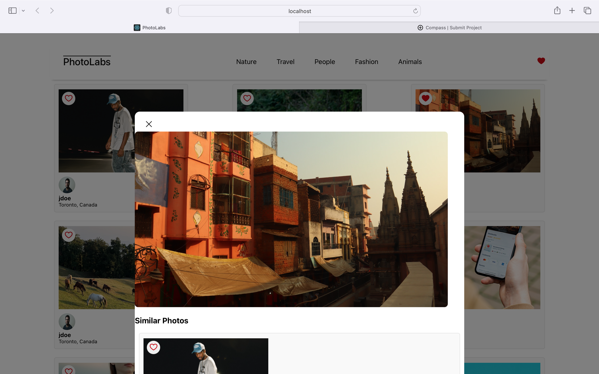

# react-photolabs
The PhotoLabs project for the Web Development React course programming.

# Photolabs
Build a client-side application using the React view-layer library

# photos



## Setup

Install dependencies with `npm install` in each respective `/frontend` and `/backend`.

## [Frontend] Running Webpack Development Server

```sh
cd frontend
npm start
```

## [Backend] Running Backend Servier

Read `backend/readme` for further setup details.

```sh
cd backend
npm start
```
